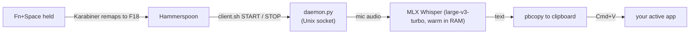

# OpenSource Wispr Flow

Hold a key, talk, let go — your words land as text in whatever app you're in.
Like [Wispr Flow](https://wisprflow.ai), except it runs **entirely on your Mac**.
No account, no cloud, no monthly bill, no audio ever leaving the machine.


## Why this exists

I dictate a lot, and cloud dictation tools always came with the same three catches:
a subscription, an internet round-trip, and my voice sitting on someone else's server.

Apple Silicon is fast enough to run Whisper locally in real time now, so none of that is
necessary. This is the whole thing: a small Python daemon that keeps a Whisper model warm
in memory and turns speech into pasted text in **under half a second**, offline.

It's the tool I use every day. It's about 500 lines of Python. That's the point.

## What you get

- **Push-to-talk.** Hold `Fn+Space`, speak, release. The text is transcribed and pasted into the active app.
- **Tap to re-paste.** A quick tap of `Fn` pastes the last transcript again.
- **Fast.** `mlx-whisper` (large-v3-turbo, fp16) on Apple Silicon: ~300–500 ms for a short sentence. The model stays warm, so there's no cold start after the first run.
- **Actually private.** Audio is captured, transcribed, and thrown away in memory. Nothing is uploaded. There is no network code.
- **Always the right mic.** It records from the MacBook's built-in microphone on purpose — even with AirPods connected — so you never get muffled dictation from an earbud mic.
- **A local history dashboard** at `localhost:7717`: every transcript, with word count and average WPM. Runs on your machine, served from the same daemon (see screenshot above).
- **Starts on login** via `launchd` and stays running.

## How it works

macOS won't let you bind the raw `Fn` key, so the hotkey path takes a small detour:



- **Karabiner-Elements** remaps `Fn+Space` -> `F18` and a `Fn` tap -> `F19` (the native `Fn` key isn't capturable).
- **Hammerspoon** listens for those keys and calls `client.sh`.
- **`daemon.py`** is a long-running process that loads the model once and listens on a Unix socket. It records while you hold the key, transcribes on release, copies to the clipboard, and pastes.

## Requirements

- A Mac with **Apple Silicon** (M1 or newer)
- [Homebrew](https://brew.sh)
- Two free apps for the hotkey layer: **Karabiner-Elements** and **Hammerspoon**

## Install

```bash
git clone https://github.com/FranciscoPereira2007/OpenSource-Wispr-Flow.git ~/dictate
cd ~/dictate

# 1. prerequisites
brew install uv
brew install --cask karabiner-elements hammerspoon

# 2. python deps + the launchd daemon (also pre-downloads the ~1.5 GB model)
bash ~/dictate/install.sh

# 3. wire up the hotkeys
bash ~/dictate/setup_hotkeys.sh
```

Then grant the permissions macOS asks for once:

1. **Karabiner-Elements** -> _Complex Modifications_ -> _Add rule_ -> enable **Dictate (Wispr-style)**.
2. Open **Hammerspoon** once -> _System Settings > Privacy & Security > Accessibility_ -> enable Hammerspoon.
3. _System Settings > Privacy > Microphone_ -> enable the venv's Python and Hammerspoon.
4. _System Settings > Keyboard_ -> turn **Use F1, F2, etc. as standard function keys** ON (otherwise macOS eats the `Fn` key).

## Check it's alive

```bash
~/dictate/client.sh PING     # -> PONG (allow ~30 s on first boot to warm the model)
~/dictate/client.sh START    # start recording
~/dictate/client.sh STOP     # transcribe + copy to clipboard
tail -f ~/dictate/logs/daemon.log
```

## Tweaks

Everything is a constant at the top of `daemon.py`:

- **Language** — `LANG = "pt"`. Use `"en"` for English, or `None` to auto-detect.
- **Model** — swap `MODEL` for a lighter one if you want more speed over accuracy:
  `mlx-community/whisper-medium-mlx`, `whisper-small-mlx`, or the English-only
  `mlx-community/distil-whisper-large-v3`.
- **Latency** — the first transcription after boot takes ~3 s (compile). Every one after that is sub-500 ms.

## Uninstall

```bash
launchctl unload ~/Library/LaunchAgents/com.fran.dictate.plist
rm ~/Library/LaunchAgents/com.fran.dictate.plist
rm ~/.config/karabiner/assets/complex_modifications/dictate.json
# then remove the DICTATE_HOOK block from ~/.hammerspoon/init.lua
rm -rf ~/dictate
```

## License

MIT — do whatever you want with it. See [LICENSE](LICENSE).
