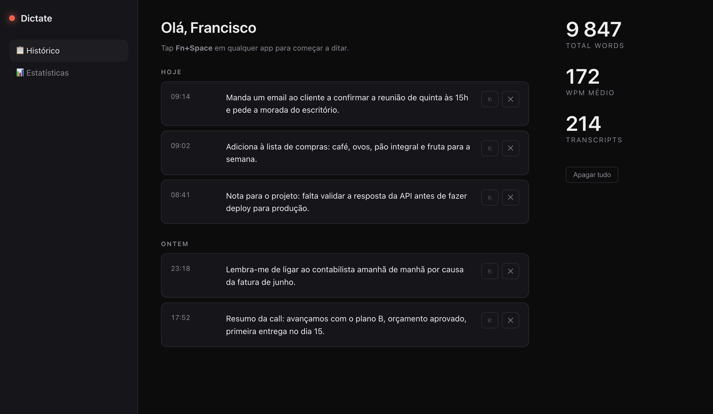
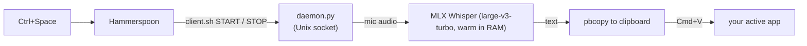

# OpenSource Wispr Flow

Hold a key, talk, let go — your words land as text in whatever app you're in.
Like [Wispr Flow](https://wisprflow.ai), except it runs **entirely on your Mac**.
No account, no cloud, no monthly bill, no audio ever leaving the machine.




## Why this exists

I dictate a lot, and cloud dictation tools always came with the same three catches:
a subscription, an internet round-trip, and my voice sitting on someone else's server.

Apple Silicon is fast enough to run Whisper locally in real time now, so none of that is
necessary. This is the whole thing: a small Python daemon that keeps a Whisper model warm
in memory and turns speech into pasted text in **under half a second**, offline.

It's the tool I use every day. It's about 500 lines of Python. That's the point.

## What you get

- **Push-to-talk.** Press `Ctrl+Space` to start, speak, press `Ctrl+Space` again to stop and paste into the active app.
- **Re-paste.** Press `Ctrl+Shift+V` to paste the last transcript again. Optional MacBook mappings for `Fn+Space` and `Fn` are also installed through Karabiner.
- **Fast.** `mlx-whisper` (large-v3-turbo, fp16) on Apple Silicon: ~300–500 ms for a short sentence. The model stays warm, so there's no cold start after the first run.
- **Actually private.** Audio is captured, transcribed, and thrown away in memory. Nothing is uploaded. There is no network code.
- **Flexible mic selection.** It prefers Apple/internal microphones, but also works with Studio Display, iMac, Mac mini, USB microphones, and the macOS default input.
- **A local learning dashboard** at `localhost:7717`: editable transcript history, word count, WPM, English/Portuguese split, use-case categories, keyboard settings, and a small phrase bank for daily practice. Runs on your machine, served from the same daemon (see screenshot above).
- **Optional voice replies.** Agents can keep writing normal text responses and also read the final summary aloud with `voice_reply.sh`.
- **Starts on login** via `launchd` and stays running.

## How it works

The main hotkey path works on MacBook keyboards and external desktop keyboards:



- **Hammerspoon** listens for `Ctrl+Space` and calls `client.sh`.
- **Karabiner-Elements** is optional for the MacBook-style shortcuts: `Fn+Space` -> `F18` and `Fn` tap -> `F19` (the native `Fn` key isn't capturable).
- **`daemon.py`** is a long-running process that loads the model once and listens on a Unix socket. It records while you hold the key, transcribes on release, copies to the clipboard, and pastes.

## Requirements

- A Mac with **Apple Silicon** (M1 or newer)
- [Homebrew](https://brew.sh)
- **Hammerspoon** for the hotkey layer
- Optional: **Karabiner-Elements** for `Fn+Space` / `Fn` mappings on MacBook keyboards

Desktop support currently means macOS desktops and external keyboards: iMac,
Mac mini, Mac Studio, Studio Display mic, USB microphones, and Windows-style
keyboards connected to a Mac. Native Windows support would need a separate
hotkey, clipboard, audio-device, and service layer because this repo uses
macOS-specific tools such as `launchd`, Hammerspoon, `pbcopy`, and AppleScript.

## Install

```bash
git clone https://github.com/FranciscoPereira2007/OpenSource-Wispr-Flow.git ~/dictate
cd ~/dictate

# 1. prerequisites
brew install uv
brew install --cask karabiner-elements hammerspoon

# 2. python deps + the launchd daemon (also pre-downloads the ~1.5 GB model)
bash ~/dictate/install.sh

# 3. wire up the hotkeys
bash ~/dictate/setup_hotkeys.sh
```

`setup_hotkeys.sh` installs the compact Wispr-style overlay: black pill, cancel
button, animated audio bars, and red stop button. If you already installed an
older version, run the same command again; it backs up the old Hammerspoon hook
and replaces it with the current GitHub version.

Then grant the permissions macOS asks for once:

1. Open **Hammerspoon** once -> _System Settings > Privacy & Security > Accessibility_ -> enable Hammerspoon.
2. Optional MacBook shortcuts: **Karabiner-Elements** -> _Complex Modifications_ -> _Add rule_ -> enable **Dictate (Wispr-style)**.
3. _System Settings > Privacy > Microphone_ -> enable the venv's Python and Hammerspoon.
4. Optional MacBook shortcuts: _System Settings > Keyboard_ -> turn **Use F1, F2, etc. as standard function keys** ON (otherwise macOS eats the `Fn` key).

## Check it's alive

```bash
~/dictate/client.sh PING     # -> PONG (allow ~30 s on first boot to warm the model)
~/dictate/client.sh START    # start recording
~/dictate/client.sh STOP     # transcribe + copy to clipboard
tail -f ~/dictate/logs/daemon.log
```

## Dashboard always-on

The local dashboard lives at `http://127.0.0.1:7717/`.

Open `http://127.0.0.1:7717/` for your real live stats. `?demo=1` is only for documentation screenshots. It shows fake fixed numbers and does not update from your real dictation history.

The dashboard includes:

- transcript history with copy, edit, and delete actions
- daily word progress
- English vs Portuguese word percentages
- use-case categories such as Code, Content, Business, Fitness, and English
- an English structure score from 0 to 10 for the latest English/mixed dictation
- words to learn from Portuguese to English
- your original phrases next to a better English version
- a Settings section with the recommended Mac/external-keyboard shortcuts and optional MacBook Fn mappings

There are two LaunchAgents:

- `com.fran.dictate`: keeps the dictation daemon, microphone, and transcription service alive.
- `com.fran.dictate.dashboard-watch`: checks the dashboard every 60 seconds. If it goes down, it restarts the daemon; when it responds again, it opens the dashboard in Chrome.

This keeps the dashboard alive while macOS is awake and your user session is running. If the Mac sleeps, shuts down, logs out, or a MacBook sleeps after closing the lid, the local dashboard and agents stop until the machine wakes again.

Useful commands:

```bash
launchctl print gui/$(id -u)/com.fran.dictate
launchctl print gui/$(id -u)/com.fran.dictate.dashboard-watch
tail -f ~/dictate/logs/dashboard-watch.log
```

## Voice replies

Dictate is already local STT: you speak, it becomes text. `voice_reply.sh` adds
the first TTS layer: an agent can finish the work, send the normal text response,
and read the same summary aloud.

```bash
~/dictate/voice_reply.sh "Task finished. The dashboard is live."
echo "Your English score today is 6 out of 10." | ~/dictate/voice_reply.sh
~/dictate/voice_reply.sh --list-voices
~/dictate/voice_reply.sh --lang en "This is a clearer female American English voice."
~/dictate/voice_reply.sh --lang pt "Esta é uma voz feminina em português de Portugal."
```

This is intentionally not real-time conversation yet. The recommended flow is:
text remains the source of truth, audio reads the final result, and real-time
streaming voice can be added later once the basic voice loop feels useful.

The default English voice is `Samantha` (`en_US`) at `155` words per minute. The
default Portuguese voice is `Joana` (`pt_PT`). Use `--lang en` or `--lang pt` to
force the language, or leave it on automatic detection.

For a better voice than macOS `say`, the next local/free upgrade should be a
real TTS model such as Kokoro, Piper, or VibeVoice instead of another built-in
system voice.

## Debug note — 2026-06-14/15

Symptom: the overlay could stay stuck in recording mode and nothing was
transcribed. Root cause: the Python process could hang in CoreAudio/PortAudio
while calling `Pa_StopStream` (`AudioOutputUnitStop`), leaving
`/tmp/dictate.sock` unresponsive even though the LaunchAgent still looked
"running".

Fixes:

- `daemon.py` closes streams with `abort()+close()` instead of `stop()+close()`.
- `daemon.py` cancels stale recordings after 5 minutes and cancels audio streams
  that stop delivering frames for 20 seconds.
- `client.sh STOP/STOP_PASTE/CANCEL` restarts the LaunchAgent if the socket is
  unresponsive while `/tmp/dictate.status` says `recording` or `transcribing`.
- Hammerspoon can clear/cancel the overlay if a recording lasts longer than 5
  minutes or `STATE` stops responding.

## Tweaks

Everything is a constant at the top of `daemon.py`:

- **Language** — `LANG = None` auto-detects Portuguese, English, and mixed dictation. Use `"pt"` or `"en"` to force a single language.
- **Vocabulary hint** — `DICTATE_INITIAL_PROMPT` can override the Whisper context prompt used for mixed EN/PT dictation and domain words.
- **Input device** — `DICTATE_INPUT_DEVICE` can be an input index or part of a device name, for example `DICTATE_INPUT_DEVICE="USB"` or `DICTATE_INPUT_DEVICE="Studio Display"`. If unset, Dictate prefers Apple/internal microphones, then the macOS default input, then the first available input. This makes the same setup work on MacBook, iMac, Mac mini, and desktops with external microphones.
- **Model** — swap `MODEL` for a lighter one if you want more speed over accuracy:
  `mlx-community/whisper-medium-mlx`, `whisper-small-mlx`, or the English-only
  `mlx-community/distil-whisper-large-v3`.
- **Latency** — the first transcription after boot takes ~3 s (compile). Every one after that is sub-500 ms.

## Uninstall

```bash
launchctl unload ~/Library/LaunchAgents/com.fran.dictate.plist
launchctl unload ~/Library/LaunchAgents/com.fran.dictate.dashboard-watch.plist
rm ~/Library/LaunchAgents/com.fran.dictate.plist
rm ~/Library/LaunchAgents/com.fran.dictate.dashboard-watch.plist
rm ~/.config/karabiner/assets/complex_modifications/dictate.json
# then remove the DICTATE_HOOK block from ~/.hammerspoon/init.lua
rm -rf ~/dictate
```

## License

MIT — do whatever you want with it. See [LICENSE](LICENSE).
